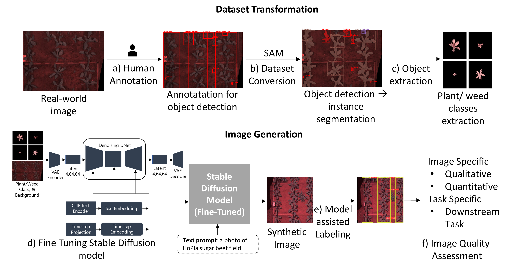

# Generative AI-based Pipeline Architecture for Increasing Training Efficiency in Intelligent Weed Control Systems

<div align="center">
  
  <p><em>Overview of the Synthetic Weed Generation Pipeline for Increasing Training Efficiency in Intelligent Weed Control Systems</em></p>
</div>

## Overview

This repository provides the official implementation of the paper *"Generative AI-based Pipeline Architecture for Increasing Training Efficiency in Intelligent Weed Control Systems"*. It introduces a generative AI training pipeline for improving data efficiency in intelligent weed control systems through the integration of:
- *Segment Anything Model (SAM)* for dataset conversion.
- *Stable Diffusion (SD)* fine-tuning using multi-subject DreamBooth.
- *YOLOv8x (extra-large)* for automated labeling.
- *Efficient YOLO Nano (YOLOv8n, YOLOv9t, YOLOv10n)* and YOLO Small (YOLOv8s, YOLOv9s, YOLOv10s)**models trained on real and mixed datasets (combinations of synthetic and real data).

---

## Key Features

- *Multi-modal Training:* Combines SAM, YOLO, and Stable Diffusion for a fully automated efficient training pipeline.
- *Efficient Dataset Conversion:* Using SAM to convert object detection dataset into instance segmentation and subsequent mask generation.
- *Synthetic Data Generation:* Fine-tunes Stable Diffusion using plant/weed and background soil images, and subsequent image generation with text prompt.
- *Automated Labeling with YOLOv8x:* use YOLOv8x for labeling datasets, improving annotation efficiency.
- *Efficient YOLO Models:* Fine-tuning lightweight YOLO Nano & YOLO Small models with an aim to deploy in edge devices.

---

## Repository Structure

```plaintext
GenAI-Pipeline_TrainEfficiency/
│── README.md            # Documentation           
│── train_sd.sh          # Shell script for Stable Diffusion training
│── data_prep_SD.ipynb   # Dataset preparation for Stable Diffusion
│── image_generation.ipynb # Inference using Stable Diffusion
│── requirements.txt     # Dependencies
│── diffusers/            # Scripts for using the Hugging Face Diffusers library
│── NR_IQA.ipynb          # Notebook for calculating No-Reference Image Quality Assessment (NR-IQA) metrics
│── SAM/                 # Segment Anything Model (SAM) scripts
│   ├── src/
│       ├── convert.py      # Image segmentation with SAM
│       ├── polygon2mask.py # Convert polygon annotations to plant/weed masks
│── YOLO_training/       # YOLO dataset preparation and training
├── ├── auto_label.ipynb    # Automated labeling using YOLOv8x/or any other YOLO model
│   ├── efficient_dataset.ipynb  # Targeted random sub-sampling with defined proportions of synthetic (Syn) and real (Real) images
│   ├── train_batch.sh      # Shell script for Batch training for YOLO models
│── data/                # GT and processed datasets
```

## Installation

### Using conda

```bash
conda create -n env python=3.8
conda activate env
pip install -r requirements.txt
```

### Download SAM checkpoint

Download the SAM (vit_h) checkpoint:
```bash
wget https://dl.fbaipublicfiles.com/segment_anything/sam_vit_h_4b8939.pth
```
Ensure the checkpoint is placed in the correct directory.

## Workflow

### 1. Dataset Preparation

Use the data_prep_SD.ipynb notebook to prepare datasets for Stable Diffusion training. This notebook:
- Creates JSON configuration files.
- Generates instance prompts for multi-subject DreamBooth.

### 2. Dataset conversion with SAM

Run SAM-based instance segmentation on images using:
```bash
python SAM/src/convert.py --checkpoint_path "path/to/sam_vit_h_4b8939.pth" \
                          --device "cuda:0" \
                          --model_type "vit_h" \
                          --image_folder "data/images" \
                          --label_folder "data/labels" \
                          --label_out_folder "data/processed/segmented_labels" \
                          --yaml_file "configs/dataset.yaml" \
                          --batch_size 10
```
### 3. Plant/weed class extraction
```bash
python SAM/src/plygon2mask.py   --image_folder /path/to/images \
                                --annotations_folder /path/to/annotations \
                                --output_folder /path/to/output

```

### 4. Stable Diffusion Training

Use the official [Hugging Face Diffusers library](https://github.com/huggingface/diffusers) to install diffusers.

Run the train_sd.sh script for Stable Diffusion training:
```bash
bash train_sd.sh 
```

### 5. Stable Diffusion Inference

Use the image_generation.ipynb notebook to generate synthetic data with a trained Stable Diffusion model:
```bash
jupyter notebook image_generation.ipynb
```
### 6. Automated Labeling

Run the yolo.ipynb notebook for automated dataset labeling:
```bash
jupyter notebook auto_label.ipynb
```
This script:
- Loads a trained YOLOv8x model.
- Removes corrupted or non-image files.
- Runs YOLOv8x inference to label images.

### 7. YOLO Training

Train YOLO models using the YOLO_training/train_batch.sh script:
```bash
bash YOLO_training/train_batch.sh
```
This script trains YOLO models on multiple datasets (sug_real, syn80_real20, etc.) using batch training.


## 📄 Citation


```bibtex
@article{modak2024generative,
  title={Generative AI-based Pipeline Architecture for Increasing Training Efficiency in Intelligent Weed Control Systems},
  author={Modak, Sourav and Stein, Anthony},
  journal={arXiv preprint arXiv:2411.00548},
  year={2024}
}
